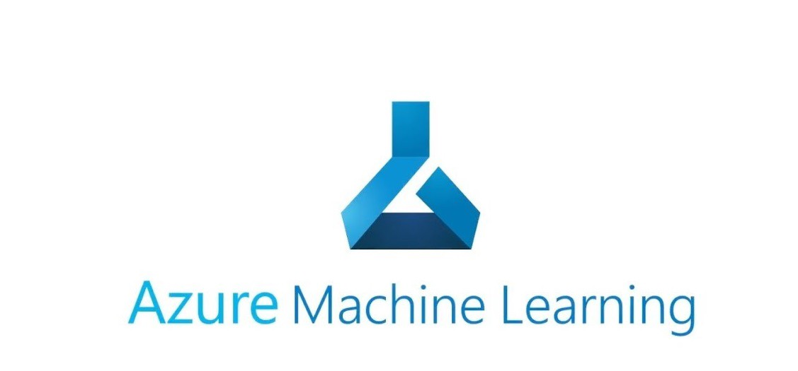
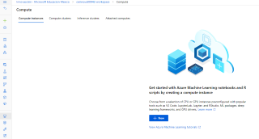

## COGNITIVE SERVICES

# IA

- Bot service--> es para crear boots, lo podemos meter donde sea

- Modelos prefabricados--> Cognitive services:

**por ejemplo:**

- **Translator** (Traductor).

- **Content Moderate** (sirve para detectar groserias en texto y audio).

- **Luis** **-->** (Comprension de lenguaje Natural).
- 
- **Custom Vision** --> (vision computacional) es hacer que la maquina entienda imagenes o videos.
- 
- **Anomaly detector** **-->** (detecta anomalias).
- 
- **Face****-->** deteccion de rostros,edad,genero y emociones.

----------------------------------------------------------------------------------------------------

Los que creamos nosotros:  nosotros mandamos datos y los resultados y la maquina solo crea reglas,

- **ML Studio** **(aprendizaje maquina)**

- **ML automatizado** 

- **Diseñador--** sirve para cuando queremos filtrar datos,

-------------------------------------------------------------------------------------------------------

## PRACTICA DE ML

- Vamos a crear un espacio en blanco de azure machine learning.

- Cuando queremos configurar las redes y demas, se hace desde el portal.

- Cuando lo quieres hacer mas sencillo es desde ML Azure.

1.- Abrimos la [Pagina de ML Azure](ml.azure.com).

2.- creamos una zona de trabajo.

3.- Lenamos los datos de siempre y le damos crear.

4.- Ahora nos vamos a la zona de trabajo que ya creamos.

5.- Nos vamos a proceso que esta del lado izquierdo.

6.- Estan dentro, en la pestaña donde dice **Instancia de proceso (Maquina Virtual)** vamos a crear una.

7.- llenamos los datos pero... 

### **Nota:**

**Location--->** La region esta bloqueada, por que afuerzas nos pide que esten en la misma region todo.

**Gpu--->** Es una maquina virtual, pero mas cara, son para entrenar maquinas virtual.Hace muchos calculos y procesos al mismo tiempo.
 
8.- Ahora le damos crear.

9.- Ahora nos vamos al apartado de datos, para meter unos datos.

10.- Le damos crear datos, pero de un archivo web y llenamos los datos que nos piden y le damos Next.

**Un archivo csv, son muchos datos separados por commas.**

11.- Una ves llenado lo que falta, le damos nuevamente Next.

12.- Esto que vemos son todas las etiquetas, (menos path que es la direccion del archivo) y le damos Next.

13.- Aca vamos a confirmar los detalles para asi poder crearla y se crea un insumo de datos.

14.- Vamos a darle click a donde dice ML Automatizado y le daremos en **Nuevo MLjob** .

15.- Aca seleccionamos la de renta de bicis y le damos NEXT.

 Ahora vamos a hacer un experimento que es una forma de hacer un modelo.

**Pero primero, vamos a crear un cluster de proceso.**

16.- Nos vamos a la seccion de proceso,y luego a donde dice "compute clusters" (cluster de procesos, son como maquinas chiquitas) ponemos unos datos y le damos Next.

17.- Ponemos un nombre, el maximo de nodos, que sera de acuerdo a tus **nucleos** y el minimo sera en 0 para que no te cobre de mas, le damos crear.

**Ahora nos regresamos a donde estabamos creando la ML automatizada.**

18.- Seguimos llenando los datos y agregamos la maquina de proceso que ya creamos  y le damos en siguiente

19.-  Le darmos click en Regression ya que queremos nosotros predecir valores.Le damos en Next y luego finalizar

20.- Con esto, tenemos creado el modelo de inteligencia artificial

21.- Y esto es TODO
